# Hackaton 2023: Attendees Onboarding.

Hackaton Def : *A hackathon is an event that brings together experts and creates a collaborative environment for solving a certain problem.*  

-  [How to login to the Azure Portal](./readme.md#how-to-login-to-the-azure-portal)
-  [Before to begin check the prerequisites](./readme.md#before-to-begin-check-the-prerequisites)
-  [How to deploy a container to Azure (Optional)](./readme.md#how-to-deploy-a-container-to-azure-optional)
-  [How to play with Azure Open AI](./readme.md#how-to-play-with-azure-open-ai)
-  [Azure Storage Explorer](../Datadesk/readme.md#azure-storage-explorer)


## How to login to the Azure Portal

You should have received an invitation by email to join the Hackaton, so you will use your own identity information to log on the Azure Portal and access to Azure Ressources.


1. Go to https://portal.azure.com

2. Sign in with your credential

3. If you get the following screen Click **Ask Later Button** (no need to set up the multifactor authentication)


4. If you are properly authenticated, this page should appear. Click on the "Maybe later" Button

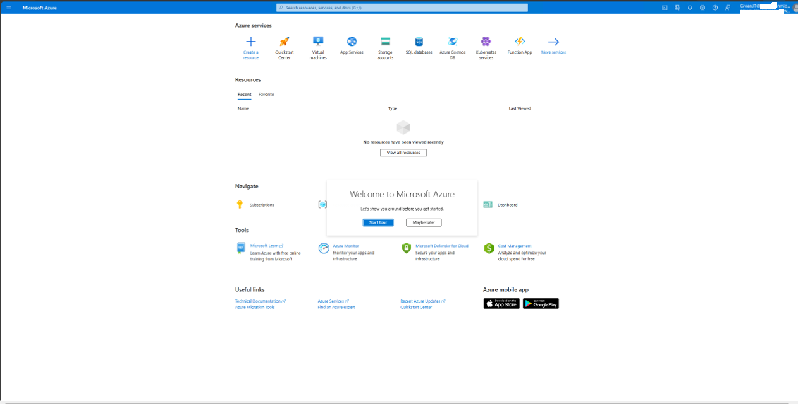


 5. On the Top Left, click on the **Show Portal Menu** and **select Resource groups**

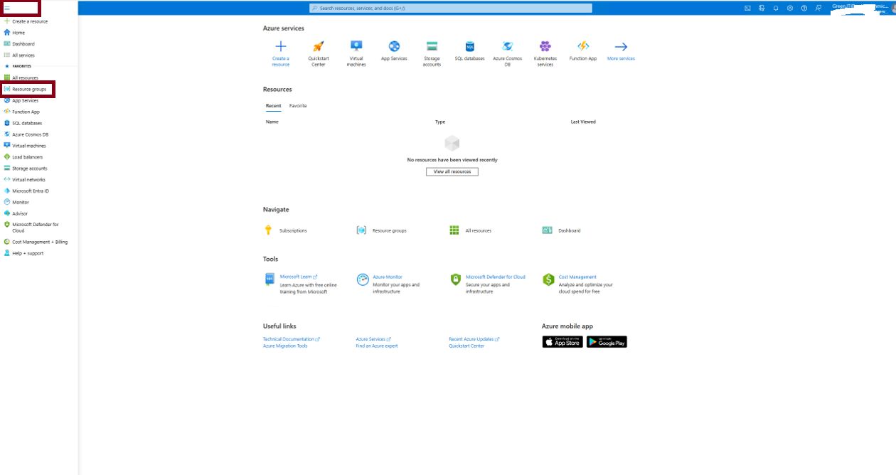

6. You should see your team resource group (i.e rg-hkt-XXX) and the rg-shareddata where all the commun data are available


7. Open you resource group, some resources are already available for you to play with 

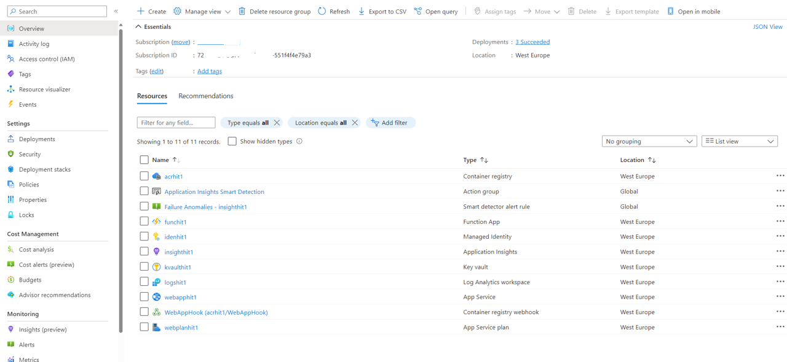


## Before to begin, check the prerequisites:

For the purpose of this Hackaton, you could use Visual Studio Code as editor.

1. [Visual Studio Code download](https://code.visualstudio.com/)

    - Chose the right OS for you.

    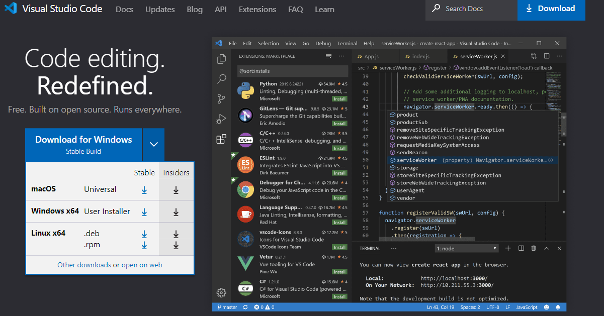

    - Then go to [VS Code Extensions market place](https://marketplace.visualstudio.com/VSCode) and install the following Extensions:
        
        1. [Azure App Service extension for VS Code](https://marketplace.visualstudio.com/items?itemName=ms-azuretools.vscode-azureappservice)
        2. [Docker extension for VS Code](https://marketplace.visualstudio.com/items?itemName=ms-azuretools.vscode-docker)
        3. [Azure Function extension for VS Code](https://marketplace.visualstudio.com/items?itemName=ms-azuretools.vscode-azurefunctions)
        4. And depending on your favorite language:
            
            1. [C# Dev Kit extension](https://marketplace.visualstudio.com/items?itemName=ms-dotnettools.csdevkit)
            2. [Extension Pack for Java](https://marketplace.visualstudio.com/items?itemName=vscjava.vscode-java-pack)
            2. [Python](https://marketplace.visualstudio.com/items?itemName=ms-python.python)
            3. [10 Must-have VS Code Extensions for JavaScript Developers](https://www.sitepoint.com/vs-code-extensions-javascript-developers/)


2. [Docker](https://www.docker.com/pricing/) (optional)

3. [Dowwnload az cli](https://learn.microsoft.com/en-us/cli/azure/install-azure-cli)

    - [Get started with Azure CLI](https://learn.microsoft.com/en-us/cli/azure/get-started-with-azure-cli)


4. - [ download Azure Storage Explorer](https://azure.microsoft.com/en-us/products/storage/storage-explorer/)

- [Get started with Storage Explorer](https://learn.microsoft.com/en-us/azure/vs-azure-tools-storage-manage-with-storage-explorer?tabs=windows)

- [How to copy files with Azure Storage Explorer](../DataDesk/README.md#azure-storage-explorer)


## How to deploy a container to Azure (Optional)

You'll deploy your code to a Web App for container, in this tutorial you'll test how to do it.
All the Azure resources Including the Container registry and the web App are already created and available in the resource group.

1. Create a Dockerfile with the following line

```docker
FROM mcr.microsoft.com/appsvc/node:10-lts

ENV HOST 0.0.0.0
ENV PORT 8080
EXPOSE 8080

ENTRYPOINT ["pm2", "start", "--no-daemon", "/opt/startup/default-static-site.js"]
```

2. Sign in to Azure with the az tools.
    
    ***az login***


3. Login to the Azure container registry.

    ***az acr login -n [REGISTRY NAME] --expose-token***
    > Note : to get the container registry name, go to the portal azure https://portal.azure.com, open the resource group rg-hackxxxxx and get the name like this 'acrhyyyy'

4. Build the image from the Azure container registry 

    ***az acr build -t [REGISTRY NAME].azurecr.io/testhack:latest -g [RESOURCE GROUP NAME] -r [REGISTRY NAME] . --platform "linux"***

    ex : az acr build -t "acrhhktXXX.azurecr.io/testhack:latest" -g "rg-hkt-XXX" --registry  "acrhhktXXX" . --platform "linux"

    > Note: Don't forget the character "." 


    if all works fine  

    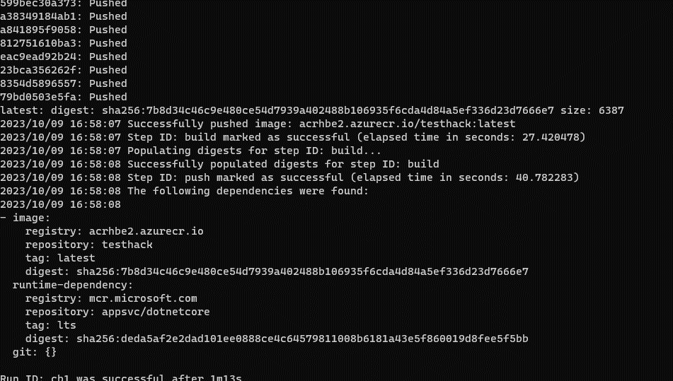

    >Note: Next time if you create an image, use the same ***tag*** you use in this sample : ex : ***acrhyyyy.azurecr.io/testhack:latest***. The reason is, a web hook is linked between the Web App and the container registry in order to push the new image to the web App directly. 
    
5 . Go to the Azure portal https://portal.azure.com, 

    - Check if the image was push to the web app
        - Select the Azure container registry acrhyyy
        - On the left pane select "Webhooks"
        - Open the Webhook and see if the status of the push is 202
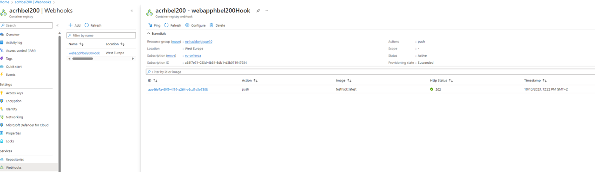

6. Open the **App Service** ***webappxxxx*** and click on the "browse" menu at the top.


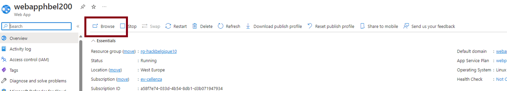


The application launch and you should see the following screen:

> Note :  The first launch can take some time while the image was pull and started. Go to deployment center and display the logs to see what's happen. 
If you get ***Gateway time out*** retry to browse.

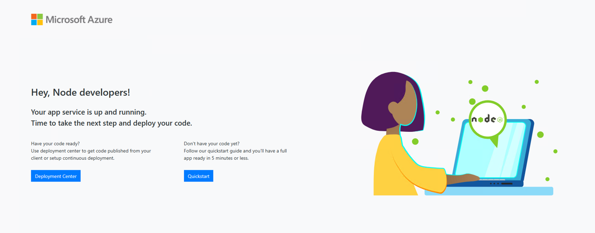


## How to play with Azure Open AI

Architecure of the app to play with. For more information go to the [github repos](https://github.com/ruoccofabrizio/azure-open-ai-embeddings-qna )

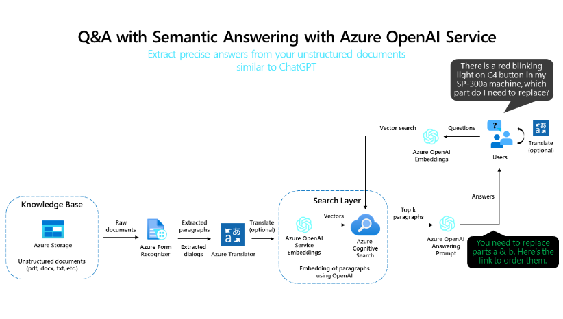


Before to begin you need to change some settings.

1. Go to the Azure Portal https://portal.azure.com

2. Open the ***openaixxx*** Azure OpenAI

    1. In the left pane select **Keys and Enpoint**, copy **KEY 1** and the Language APIs URL

3. Create deployment (See Section [Create deployment](#create-deployment))    

2. Open the XXXX-site app service.

3. In the left pane ->Configuration->

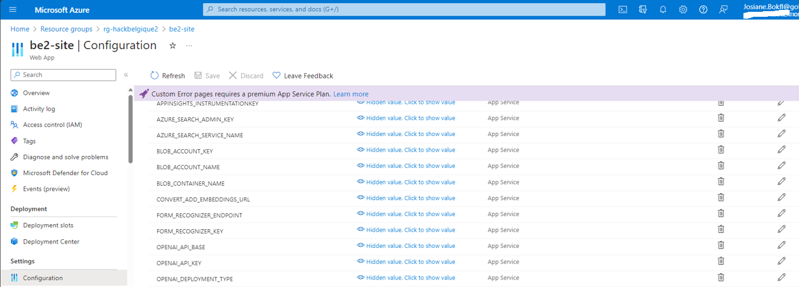


Check the following parameters.

  - OPEN_API_BASE = then past the Language APIs Url

  - OPEN_API_KEY = then past KEY 1

  - Check OPENAI_EMBEDDINGS_ENGINE_DOC and OPENAI_EMBEDDINGS_ENGINE_QUERY = **text-embedding-ada-002**

  - Then Save the new parameters

  - Then browse the Web App (this could be take time..)

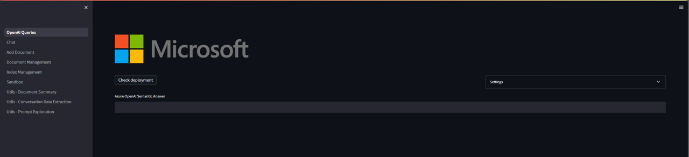

  - Then select Check deployment if all work fine, your are ready to add your content.

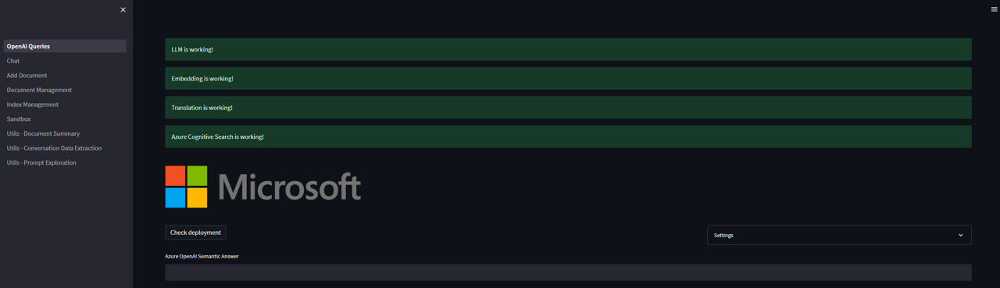

Important : If you get the following message

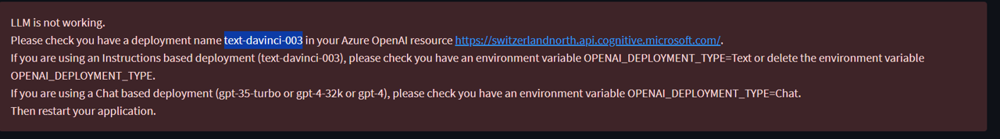

1.  In the OpenAI portal, create a [new deployment](#create-deployment) named ***text-davinci-003*** and choose ***gpt-4***

2. Open the XXXX-site app service.

3. In the left pane ->Configuration->

-  OPENAI_DEPLOYMENT_TYPE = Change ***Text*** by ***Chat***

4. Try again to check the configuration

5. If all works fine, you are ready to add your first documents and begin to chat with Azure OpenAI.

6. Your First Chat with Azure OpenAI


You probably get nothing, because you don't have added any document yet 

6. Select ***Add Document*** and add your first document. You can also add multiple files using ***Add Documents in Batch***


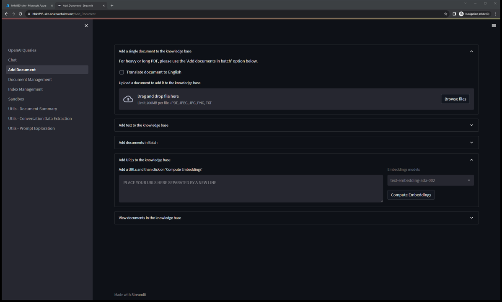


Then try to ask something usefull

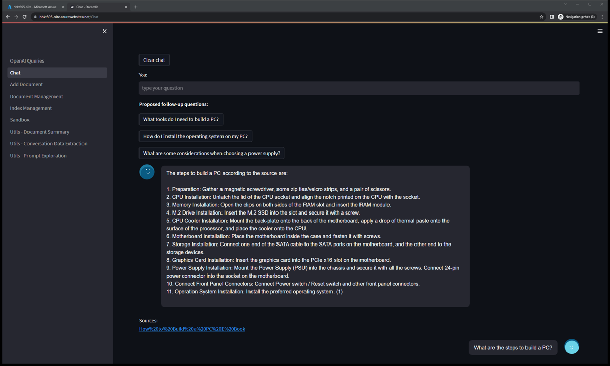


### Create deployment

Navigate to Azure OpenAI Studio at https://oai.azure.com/ and sign-in with your Hackathon credentials (by default they have access to your OpenAI resource). During or after the sign-in workflow, select, if necessary, the appropriate directory Azure subscription, and Azure OpenAI resource.


From the Azure OpenAI Studio landing page  you can navigate further to explore examples for prompt completion, manage your deployments and models, and find learning resources such as documentation and community forums.

Go to "Deployments" and create a new deployment
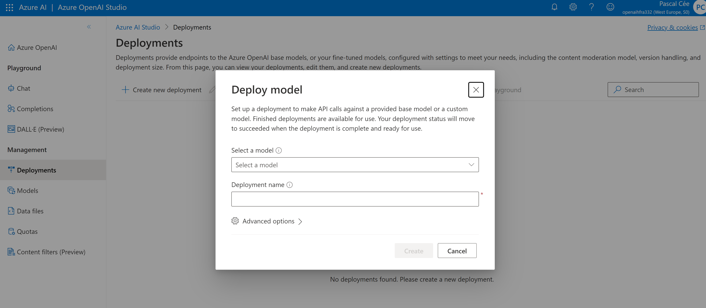

Select from one of the available models

**GPT-4**

GPT-4 can solve difficult problems with greater accuracy than any of OpenAI's previous models. Like GPT-3.5 Turbo, GPT-4 is optimized for chat and works well for traditional completions tasks. Use the Chat Completions API to use GPT-4.

* gpt-4
* gpt-4-32k

You can see the token context length supported by each model in the model summary table.

**GPT-3.5**

GPT-3.5 models can understand and generate natural language or code. The most capable and cost effective model in the GPT-3.5 family is GPT-3.5 Turbo, which has been optimized for chat and works well for traditional completions tasks as well. GPT-3.5 Turbo is available for use with the Chat Completions API. GPT-3.5 Turbo Instruct has similar capabilities to text-davinci-003 using the Completions API instead of the Chat Completions API. We recommend using GPT-3.5 Turbo and GPT-3.5 Turbo Instruct over legacy GPT-3.5 and GPT-3 models.

* gpt-35-turbo
* gpt-35-turbo-16k
* gpt-35-turbo-instruct


**Embeddings models**

*Important*

*We strongly recommend using text-embedding-ada-002 (Version 2). This model/version provides parity with OpenAI's text-embedding-ada-002. Even if you are currently using Version 1 you should migrate to Version 2 to take advantage of the latest weights/updated token limit. Version 1 and Version 2 are not interchangeable, so document embedding and document search must be done using the same version of the model.*

The previous embeddings models have been consolidated into the following new replacement model:

* text-embedding-ada-002


For this hackathon use the embeddings model, *text-embedding-ada-002*


To avoid any confusion we do suggest providing the same to your deployment as the intial model name:

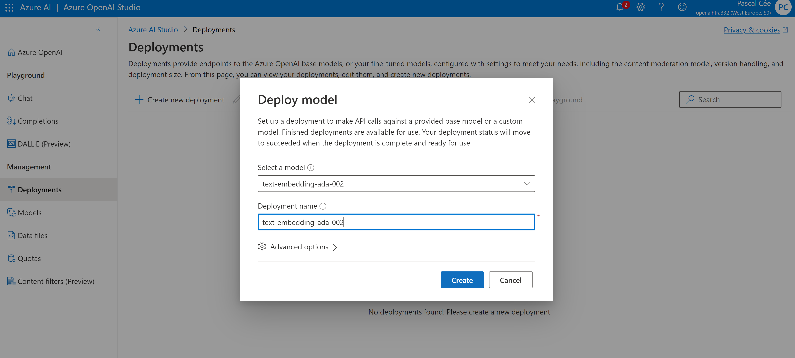

[Azure Open AI Documentation](https://learn.microsoft.com/en-us/azure/ai-services/openai/)


## How to create/deploy an Azure function to Azure

- [Python: Develop Azure Functions by using Visual Studio Code](https://learn.microsoft.com/en-us/azure/azure-functions/functions-develop-vs-code?tabs=node-v3%2Cpython-v2%2Cisolated-process&pivots=programming-language-python)

- [Javascript: Develop Azure Functions by using Visual Studio Code](https://learn.microsoft.com/en-us/azure/azure-functions/functions-develop-vs-code?tabs=node-v3%2Cpython-v2%2Cisolated-process&pivots=programming-language-javascript)

- [Java: Develop Azure Functions by using Visual Studio Code](https://learn.microsoft.com/en-us/azure/azure-functions/functions-develop-vs-code?tabs=node-v3%2Cpython-v2%2Cisolated-process&pivots=programming-language-java)

- [C#: Develop Azure Functions by using Visual Studio Code](https://learn.microsoft.com/en-us/azure/azure-functions/functions-develop-vs-code?tabs=node-v3%2Cpython-v2%2Cisolated-process&pivots=programming-language-csharp)

> Note: The Azure function is already created in Azure, and available in the resource group.
