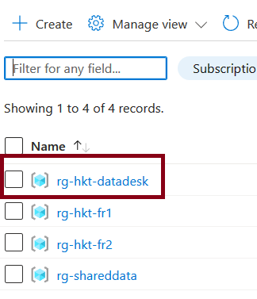
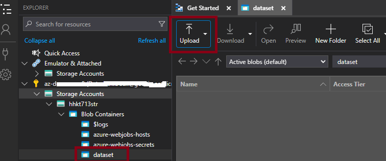
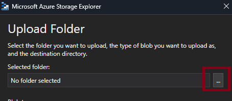

# DataDesk

- [How to login to the Azure Portal](./readme.md#how-to-login-to-the-azure-portal)
- [Before to begin, check the prerequisites](./readme.md#before-to-begin-check-the-prerequisites)
- [Azure Storage Explorer](./readme.md#azure-storage-explorer)
- [How to play with Azure OpenAI](../Attendees/README.md#how-to-play-with-azure-open-ai)

## How to login to the Azure Portal

You should have received an invitation by email to join the Hackaton, so you will use your own identity information to log on the Azure Portal and access to Azure Ressources.

1. Go to https://portal.azure.com

2. Sign in with your credential

3. If you get the following screen Click **Ask Later Button** (no need to set up the multifactor authentication)

4. If you are properly authenticated, this page should appear. Click on the "Maybe later" Button

 5. On the Top Left, click on the **Show Portal Menu** and **select Resource groups**

6. You should see all the teams resource groups, the rg-hkt-datadesk group (it's yours) and the rg-SharedData where all the commun data are available

In the rg-shareddata resource group there is only a storage account where all the attendees could pickup data.
In the rg-hkt-datadesk, some resources are already available, including Azure OpenAI where you can play with.

Go to [How to play with Azure Open AI](../Attendees/readme.md#how-to-play-with-azure-open-ai) if you want more details

## Before to begin, check the prerequisites:

- [ download Azure Storage Explorer](https://azure.microsoft.com/en-us/products/storage/storage-explorer/)

- [Get started with Storage Explorer](https://learn.microsoft.com/en-us/azure/vs-azure-tools-storage-manage-with-storage-explorer?tabs=windows)

- [Download az cli](https://learn.microsoft.com/en-us/cli/azure/install-azure-cli)

- [Get started with Azure CLI](https://learn.microsoft.com/en-us/cli/azure/get-started-with-azure-cli)

## Azure Storage Explorer

*Microsoft Azure Storage Explorer is a standalone app that makes it easy to work with Azure Storage data on Windows, macOS, and Linux.*

- Launch Azure Explorer

- First you need to sign to Azure with your credentials

- Once Authenticated select **Open Explorer** to have access to the hackaton storage accounts

- You should see the the list of the storage accounts you have access

### Copy a folder/sub folders with Azure Storage Explorer

Before to copy, if you want to identify your storage account.

- Open the ***rg-hkt-datadesk*** resource group in the portal https://azure.portal.com,

- Find your storage account named ***hhktXXXstr***

 

- Go back to ***Azure Explorer***
- Select ***Blob Contenaires***, click right  then ***Create Blob container***
name it as you want but in lowercase. for example ***dataset***

- **Upload** local folder or file you want to copy to Azure Storage in the previous container.

- Select Upload ***Folder or File*** 

    
- Then select a folder or a file

- Azure Explorer copy the folder from  your pc to the storage account

 
 ### Copy from the datadesk Storage Account to teams's Storage Account

-  Select the folder you want to copy, then ***Copy*** button 

- Then select the destination storage account open the ***document*** container  then paste

- Create a new blob container (ex ***dataset***)

- Select this new container, then paste

If you want to easily identify the storage account for a team. 
- Go back to the Azure Portal: https://portal.azure.com

- Open the teams's resource group: ex ***rg-hkt-fr1***

- In the section Tags, pick the team name and the deployprefix. Here ***hhkt895***

