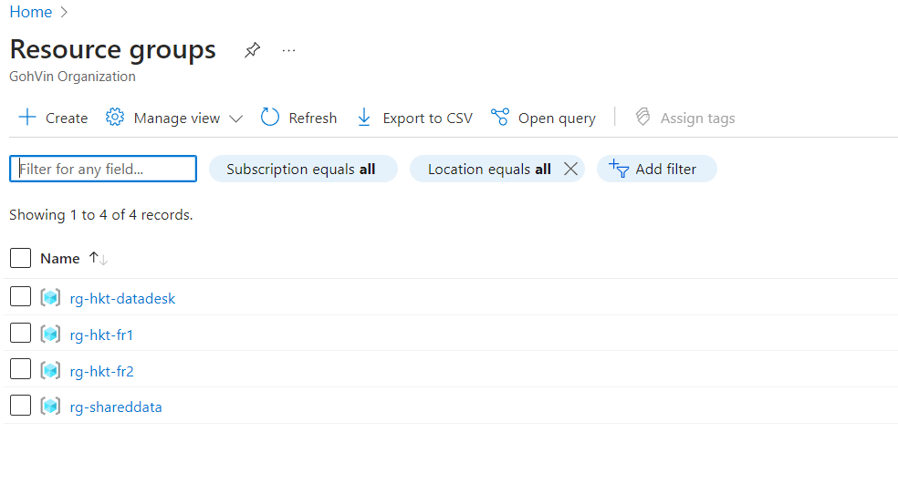

# DataDesk

## How to login to the Azure Portal

You should have received an invitation by email to join the Hackaton, so you will use your own identity information to log on the Azure Portal and access to Azure Ressources.

1. Go to https://portal.azure.com

2. Sign in with your credential

3. If you get the following screen Click **Ask Later Button** (no need to set up the multifactor authentication)

4. If you are properly authenticated, this page should appear. Click on the "Maybe later" Button

 5. On the Top Left, click on the **Show Portal Menu** and **select Resource groups**

6. You should see all the teams resource groups and the rg-hack-datadesk group

7. Open It, some resources are already available.

## Before to begin, check the prerequisites:

- [ download Azure Storage Explorer](https://azure.microsoft.com/en-us/products/storage/storage-explorer/)

- [Get started with Storage Explorer](https://learn.microsoft.com/en-us/azure/vs-azure-tools-storage-manage-with-storage-explorer?tabs=windows)

- [Download az cli](https://learn.microsoft.com/en-us/cli/azure/install-azure-cli)

- [Get started with Azure CLI](https://learn.microsoft.com/en-us/cli/azure/get-started-with-azure-cli)

## Azure Storage Explorer

*Microsoft Azure Storage Explorer is a standalone app that makes it easy to work with Azure Storage data on Windows, macOS, and Linux.*

- Launch Azure Explorer

- First you need to sign to Azure with your credentials

- Once Authenticated select **Open Explorer** to have access to the hackaton storage accounts

- You should see the the list of the storage accounts you have access

> Important  : The storage accounts begining with ***hxxxxstr*** are storage for the attendees's teams. The storage ***hdatXXXstr is your***. 
You could check in the Azure portal https://portal.azure.com and open the ***rg-hack-datadesk***

### Copy a folder/sub folders with Azure Storage Explorer

-  Open the Storage ***hdatXXXstr*** then select the container named "document"

> Note: It's important for the Hackaton and the sample app to choose the container document

- **Upload** local folder you want to copy to Azure Storage

 
 ### Copy from Storage account to Storage account

- Select the source folder

- Then select the destination storage account open the ***document*** container  then paste

